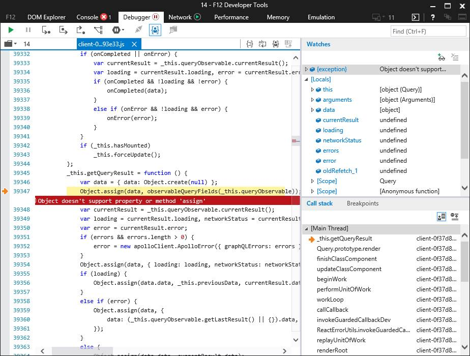
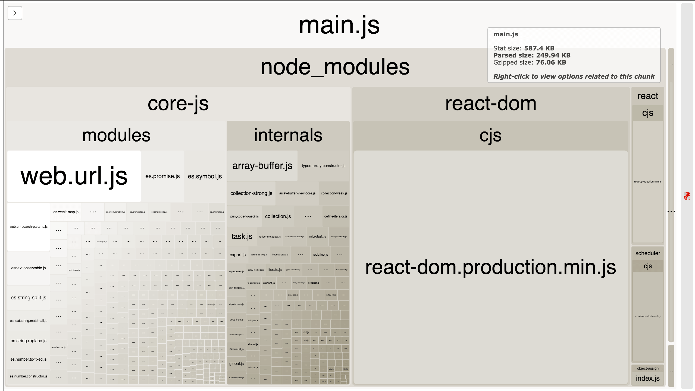
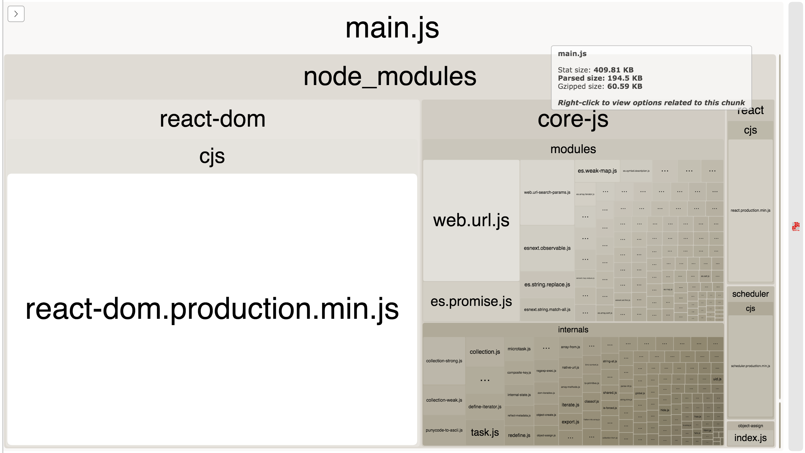
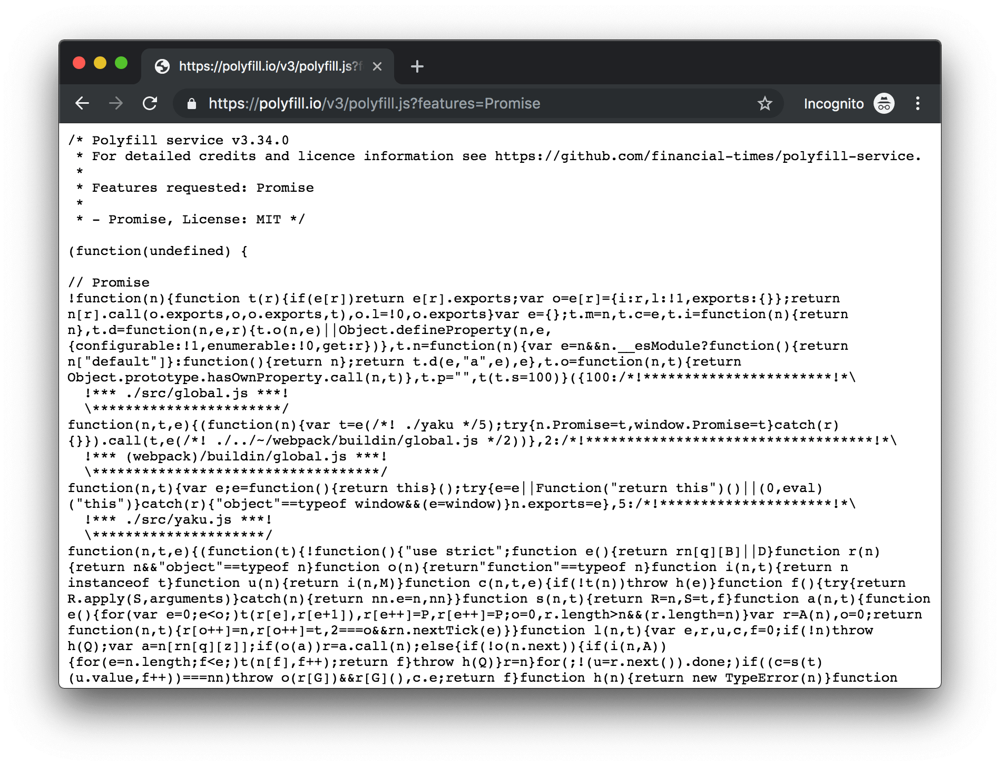

# 一文搞清楚前端 polyfill

> polyfill 在英文中有垫片的意思，意为兜底的东西。在计算机科学中，指的是对未能实现的客户端上进行的"兜底"操作。打补丁在前端 er 是件习以为常的事情，结合笔者日常工作经验，总结出 3 种打补丁方式。涉及`@babel/preset-env` 、`@babel/polyfill`、`@babel/transform-runtime`、`@babel/runtime` 以及 `core-js` 。权当抛砖引玉，如有纰漏，不令赐教。

总的来说，打补丁主要有三种方法：

1. 手动打补丁
2. 根据覆盖率自动打补丁
3. 根据浏览器特性，动态打补丁

三种方法又可以相互借鉴进行组合，来完成业务所需的补丁。分别介绍：

### 手动打补丁

在石器时代，我们是手动导入所需的补丁，以 ES6 的 object#assign 为例 ，即使在 IE 11 上，仍会报错



所以我们需要打上相应的补丁。可以用第三方成熟的 package ，也可以使用 MDN 提供的模板进行打补丁：

```javascript
Object.assign = require('object-assign')
// or

// Refer: https://developer.mozilla.org/en-US/docs/Web/JavaScript/Reference/Global_Objects/Object/assign
if (typeof Object.assign != 'function') {
  // Must be writable: true, enumerable: false, configurable: true
  Object.defineProperty(Object, 'assign', {
    value: function assign(target, varArgs) {
      // .length of function is 2
      'use strict'
      if (target == null) {
        // TypeError if undefined or null
        throw new TypeError('Cannot convert undefined or null to object')
      }

      var to = Object(target)

      for (var index = 1; index < arguments.length; index++) {
        var nextSource = arguments[index]

        if (nextSource != null) {
          // Skip over if undefined or null
          for (var nextKey in nextSource) {
            // Avoid bugs when hasOwnProperty is shadowed
            if (Object.prototype.hasOwnProperty.call(nextSource, nextKey)) {
              to[nextKey] = nextSource[nextKey]
            }
          }
        }
      }
      return to
    },
    writable: true,
    configurable: true,
  })
}
```

问题是解决了，但优势和劣势也相当明显：优势是保持最小化引入，不会有额外的冗余代码开销，保证了应用的性能。劣势是手动导入不易管理和维护，对于多样化的 polyfill 和变化多端的 Web 应用维护成本比较大。

### 根据覆盖率自动打补丁

在黑魔法 Webpack 的加持下，我们可以更现代化的方式打补丁。这其中相关的依赖有: `@babel/preset-env`、 `@babel/plugin-transform-runtime` 、 `core-js`，`@babel/polyfill` 。先逐一介绍它们：

1. `@babel/preset-env` - 按需编译和按需打补丁

   > `@babel/preset-env` is a smart preset that allows you to use the latest JavaScript without needing to micromanage which syntax transforms (and optionally, browser polyfills) are needed by your target environment(s). This both makes your life easier and JavaScript bundles smaller!

   翻译过来就是`@babel/preset-env` 会根据目标环境来进行编译和打补丁。具体来讲，是根据参数 `targets` 来确定目标环境，默认情况下它编译为 ES2015，可以根据项目需求进行配置：

   ```json
     ...
     presets: [
       [
         '@babel/preset-env',
         {
           // 支持chrome 58+ 及 IE 11+
           targets: {
             chrome: '58',
             ie: '11',
           }
         },
       ],
     ]
     ...
   ```

   具体 targets 参数可参见 [browserlist](https://github.com/browserslist/browserslist).

2. `core-js` JavaScript 标准库

   [core-js](https://github.com/zloirock/core-js) 是实现 JavaScript 标准运行库之一，它提供了从 ES3 ～ ES7+ 以及还处在提案阶段的 JavaScript 的实现。

3. `@babel/plugin-transform-runtime` - 重利用 Babel helper 方法的 babel 插件

   > A plugin that enables the re-use of Babel's injected helper code to save on codesize.

   [@babel/plugin-transform-runtime](https://babeljs.io/docs/en/babel-plugin-transform-runtime) 是对 Babel 编译过程中产生的 helper 方法进行重新利用(聚合)，以达到减少打包体积的目的。此外还有个作用是为了避免全局补丁污染，对打包过的 bunler 提供"沙箱"式的补丁。

4. `@babel/polyfill` - core-js 和 regenerator-runtime 补丁的实现库

   > Babel includes a [polyfill](<https://en.wikipedia.org/wiki/Polyfill_(programming)>) that includes a custom [regenerator runtime](https://github.com/facebook/regenerator/blob/master/packages/regenerator-runtime/runtime.js) and [core-js](https://github.com/zloirock/core-js).
   >
   > This will emulate a full ES2015+ environment (no < Stage 4 proposals) and is intended to be used in an application rather than a library/tool. (this polyfill is automatically loaded when using `babel-node`)

   `@babel/polyfill` 通过定制 `polyfill` 和 `regenerator`，提供了一个 ES2015+ 环境 `polyfill`的库。因为它是由其他两个库实现的，直接引入其他两个库即可，所以已被**[废弃](https://babeljs.io/docs/en/babel-polyfill)**。

   ```js
   // 实现 @babel/polyfill 等同效果
   import 'core-js/stable'
   import 'regenerator-runtime/runtime'
   ```

#### 使用方法

根据构建的目标不同，笔者认为应该分为两种打补丁方式：**应用的补丁**和**库的补丁**：

##### 应用的补丁 - 使用`@babel/preset-env` + `useBuiltIns`

既然`core-js` 包括了所有的 JavaScript 标准库，那有什么方法能根据应用的兼容目标来自动获取补丁呢？这里就用到 `@babel/preset-env` 的 `useBuiltIns` 参数了。`useBuiltIns` 告诉了`@babel/preset-env` 如何根据应用的兼容目标(targets)来处理 `polyfill`。

首先，在应用入口引入`core-js`:

```javascript
import 'core-js'
```

然后，配置 `useBuiltIns` 参数为 `entry`，并指定 core-js 版本:

```json
{
  "presets": [
    [
      "@babel/preset-env",
      {
        "useBuiltIns": "entry",
        "corejs": 3
      }
    ],
    "@babel/preset-react"
  ]
}
```

代码示例见:[babel-preset-env-1](https://github.com/chen86860/happy-with-polyfill/tree/master/example/babel-preset-env-1): 打包后的结果为：



其默认转换所有 ECMAScript 2015+ 代码。除非业务需要，否则应该指定应用所要支持的浏览器环境，以避免不必要的补丁，减少打包输出体积。支持环境可以通过 `targets` 参数来指定，其语法可参考 [browserslist](https://github.com/browserslist/browserslist) 来确认。使用方法也很简单，假设应用只需支持到 Chrome 58：

```json
{
  "presets": [
    [
      "@babel/preset-env",
      {
        "useBuiltIns": "entry",
        "corejs": 3,
        "targets": {
          "chrome": 58
        }
      }
    ],
    "@babel/preset-react"
  ]
}
```

可以看到，打包后的体积明显小了不少：



如果应用引入了多个第三库，并且它们存在公用的 helper 方法，就应该引入`@babel/plugin-transform-runtime`来减少打包体积。使用方法不再赘述，可参照[文档](https://babeljs.io/docs/en/babel-plugin-transform-runtime)。

此外，`@babel/preset-env` 的 useBuiltIns 值还有个一实验性的值 `usage` ，其作用是根据不同文件所需的补丁来引入对应的补丁，能一定程度上减少不必要的补丁。参照[usebuiltins-usage-experimental](https://babeljs.io/docs/en/babel-preset-env#usebuiltins-usage-experimental)。

以上，是根据覆盖率来给应用打补丁的方法，简单总结下：

1. 在应用入口引入 `core-js`

   ```js
   import 'core-js'
   ```

2. 使用 `@babel/preset-env`，指定 `useBuiltIns` 、`core-js` 以及根据应用确定的`targets`

   ```json
   {
     "presets": [
       [
         "@babel/preset-env",
         {
           "useBuiltIns": "entry",
           "corejs": 3,
           "targets": {
             "chrome": 58
           }
         }
       ],
       "@babel/preset-react"
     ]
   }
   ```

3. 如项目引入多个三方库包含公用的 helper 方法，引入 `@babel/plugin-transform-runtime` 重用方法，减少 打包体积。

##### 库的补丁 - 只提供库所依赖的专有补丁

由于库是被应用所引入的，所以本身不应该提供诸如 `Promise`、`Map` 等常用的补丁，这些应该由应用本身去提供，库本身应该只引入自己所专有的库。

举例来说，比如我想做一个支持多语言的日期选择器组件，就该引入多语言实现的 polyfill，比如[Intl](https://github.com/andyearnshaw/Intl.js/)。

### 根据浏览器特性，动态打补丁

以上两种方法都有一个弊端——补丁的冗余。以 `Object#assign` 来说，在支持这个特性的浏览器来说，就没必要引入这个补丁，势必造成了一定的补丁冗余，这就有了根据浏览器特性动态打补丁的方案。

[Polyfill.io ](<[https://polyfill.io](https://polyfill.io/)>)就是实现这个方案的服务，它会更具浏览器的 UA 不同，返回不一样的补丁。如想要 `Promise` 补丁，在页面引入：

```html
<script src="https://polyfill.io/v3/polyfill.js?features=Promise"></script>
```

如在高版本的浏览器(Chrome 75)上，打开链接会返回空页面：

```js
/* Polyfill service v3.34.0
 * For detailed credits and licence information see https://github.com/financial-times/polyfill-service.
 *
 * Features requested: Promise
 *  */

/* No polyfills found for current settings */
```

如果将浏览器的 UA 改为 IE 11，将会返回相应的 `polyfill`:



还可以附加查询参数来定制 Polyfill，具体可参照官方[文档](https://polyfill.io/v3/url-builder/)。

此外，如果对 Polyfill.io 的稳定性和安全性有要求，可以根据开源的 [polyfill service](https://github.com/Financial-Times/polyfill-service) 搭建自己的服务，然后部署到 CDN 上。

### 未来

基于目前方案，笔者认为 **按需特性补丁** + **在线补丁**才是未来的终极方案。按需特性可参照 `useBuiltIns` 的 `usage` 参数实现——只在当前文件引入必要的补丁，而且只引入一次。在线补丁使用 [polyfill service](https://github.com/Financial-Times/polyfill-service)，两者结合，即保证了补丁了最小化引入，也会根据设备的不同打不同的补丁。

以上。
