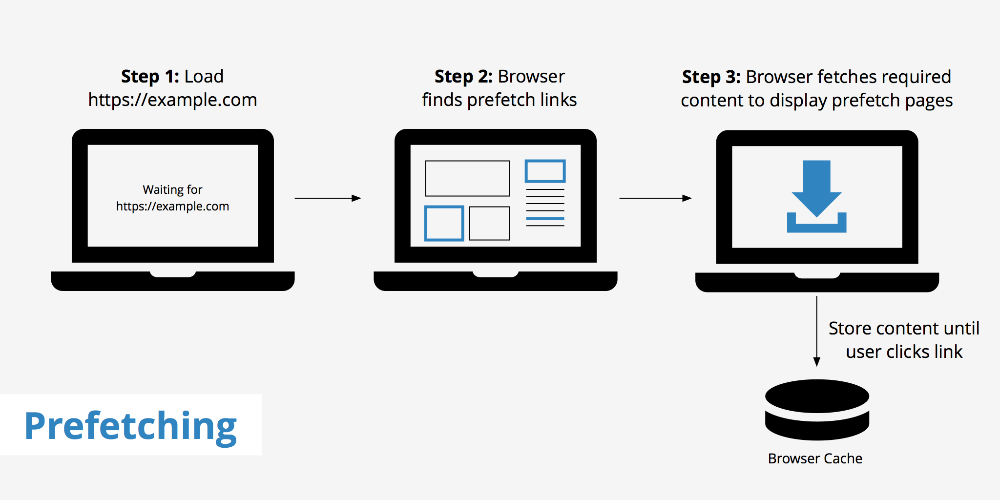

# 利用资源预加载提升网站性能

在 9102 年，谈下如何利用 HTML 的一些新指令来预先资源，以此提升网站性能。内容主要包括：`preload`, `prefetch`, `dns-prefetch`, `prerender`, `preconnect`。

### `preload`

优先加载资源。对浏览器载入资源的优先级(priority)进行干预，减少 TTI 时间，也有利于浏览器对资源类型的快速判断。多用于页面主要资源的加载.

语法：

```html
<link rel="preload" herf="{sourceURI}" as="{sourceType}" />
```

- sourceURI: 资源地址
- sourceType: 资源类型，目前支持`script`/`style`/`image`/`font`/`document`

例：

```html
<link rel="preload" herf="/example.js" as="script" />
```

### `prefetch`

预载资源。对用户可能用到资源进行加载（但不执行），并缓存在内存中。在实际调用时可节省加载资源时间。



语法：

```html
<link rel="prefetch" herf="{sourceURI}" />
```

- sourceURI: 资源地址

### `dns-prefetch`

DNS 预解析。预先进行 DNS 查询，在用户浏览页面同时，可解析将要用到的域名。

语法：

```html
<link rel="dns-prefetch" href="{domain}" />
```

例：

```html
<link rel="dns-prefetch" href="//fonts.googleapis.com" />
```

### `prerender`

预载资源并执行。和 `prefetch` 类似，对资源进行加载并执行
语法：

```html
<link rel="prerender" herf="{sourceURI}" />
```

### `preconnect`

预先建立 HTTP 连接。包括 DNS 查询、TCP 握手链接建立以及 TLS 连接。


```html
<link href="https://cdn.domain.com" rel="preconnect" crossorigin />
```

## 总结

我们可以使用 `preload` 对页面关键内容进行优先加载，使用 `prefetch` 加载预测出用户可能需要的资源，使用 `dns-prefetch` 预先进行 DNS 查询，使用 `prerender` 预先加载并执行资源，使用`preconnect` 预先建立连接。可以看到，随着 Web 开发的发展，开发者们可以更精准的控制内容的获取和展现，在 Web 应用性能和速度指标上能更进一步。

## 参考

- [Resource Hints](https://www.w3.org/TR/resource-hints/)
- [Resource Hints - What is Preload, Prefetch, and Preconnect?](https://www.keycdn.com/blog/resource-hints)
