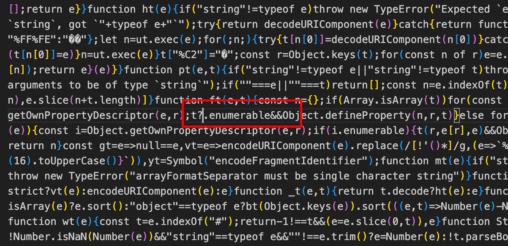
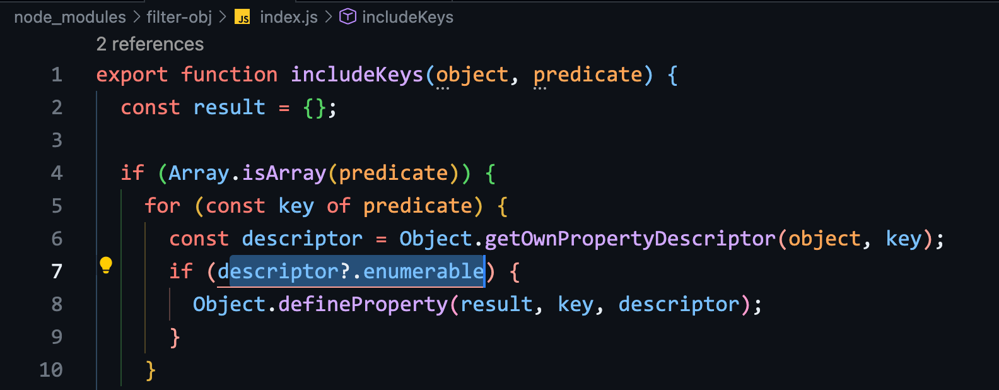
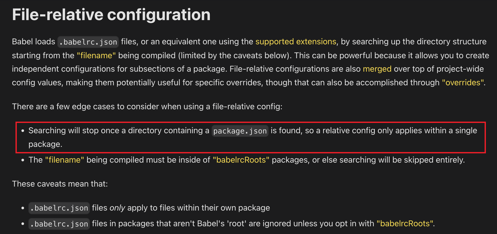
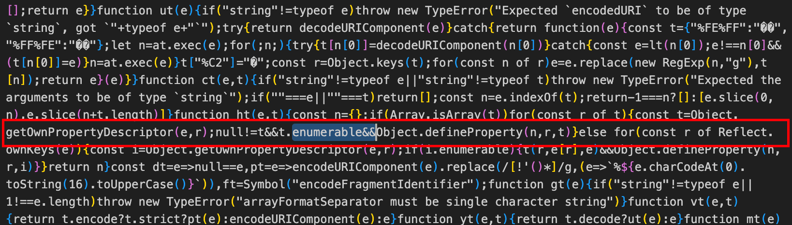

# 如何解决低端机型上的 JavaScript 可选链报错

## 背景

业务反馈显示，某些低端设备上的前端页面运行时出现错误。

定位问题后发现，在 JavaScript 文件中出现了 `Unexpected token .` 的报错。以下是错误代码位置的截图：



## 问题分析

错误明显是由于使用了 [Optional Chaining（可选链）语法](https://developer.mozilla.org/en-US/docs/Web/JavaScript/Reference/Operators/Optional_chaining) 引发的。这是 ES2020 中的新语法，不被某些旧版本浏览器支持（如 Chrome 80 以下、Safari 13.1 以下），它们需要编译工具进行代码转换。

### 工程背景

项目用 [webpack](https://webpack.js.org/) 来构建，搭配 `babel-loader` 对 JavaScript 文件进行编译，并在 `.babelrc` 文件中配置了 `@babel/preset-env`，目标浏览器设定为 Chrome 69 以上。关键配置文件如下：

#### package.json

为便于维护，将目标浏览器配置 `browserslist` 独立置于 `package.json`，其语法参考 [browserslist](https://github.com/browserslist/browserslist)，配置详情如下：

```json
{
  "name": "project-name",
  "scripts": {
    "start": "webpack serve --mode development",
    "build": "webpack --mode production"
  },
  "dependencies": {
    "core-js": "^3.35.0"
  },
  "devDependencies": {
    "@babel/core": "^7.15.0",
    "@babel/preset-env": "^7.23.8",
    "webpack": "^5.51.1",
    "webpack-cli": "^4.8.0"
  },
  "browserslist": {
    "production": ["> 0.5%", "chrome >= 69", "not dead"],
    "development": ["last 1 chrome version"]
  }
}
```

#### webpack.config.js

配置 `babel-loader` 进行 JavaScript 编译，并忽略 `node_modules` 目录以缩短编译时间。关键设置如下：

```js
module: {
  rules: [
    {
      test: /\.(js|jsx|ts|tsx)$/,
      exclude: /node_modules/,
      use: {
        loader: 'babel-loader',
      },
    },
  ],
}
```

#### .babelrc

使用 [@babel/preset-env](https://babeljs.io/docs/babel-preset-env) 预设，它按照目标浏览器或运行环境的设置，自动转换代码。配置如下：

```json
{
  "presets": [
    [
      "@babel/preset-env",
      {
        "useBuiltIns": "entry",
        "corejs": "3.35"
      }
    ]
  ]
}
```

## 解决方案

错误信息提示可选链语法问题，搜索得知项目依赖 [query-string](https://www.npmjs.com/package/query-string/v/8.1.0)，该库又依赖了 [filter-obj](https://www.npmjs.com/package/filter-obj) 包，而 [filter-obj v5.1.0](https://www.npmjs.com/package/filter-obj/v/5.1.0) 版本构建产物中包含 Optional Chaining 语法：



对其进行语法转换便可解决问题。

## 初步尝试

原始 [webpack 配置](#webpackconfigjs) 中通过 `exclude` 排除了 `node_modules`，原假设是该目录下所有包产物都是符合 ES5 规范的。为缩短编译时间而设置的。

现在看来，不能全信第三方包会遵守此规范，故需对 `node_modules` 中的文件也做编译处理。

去除之前的 `exclude` 配置，更新后的 webpack 配置如下：

```js
module: {
  rules: [
    {
      test: /\.(js|jsx|ts|tsx)$/,
      use: {
        loader: 'babel-loader',
      },
    },
  ],
}
```

但重新编译后发现，结果中仍然保留有 Optional Chaining 语法，错误依然出现在 `filter-obj` 的文件中：


## 再次分析

调整 webpack 配置后，`filter-obj` 中的 Optional Chaining 语法为何没有被替换？是否是 `@babel/preset-env` 预设未生效？

修改 `.babelrc` 文件，开启 `@babel/preset-env` 预设的 `debug` 模式，查看编译日志：

```json
{
  "presets": [
    [
      "@babel/preset-env",
      {
        "useBuiltIns": "entry",
        "corejs": "3.35",
        "debug": true
      }
    ]
  ]
}
```

编译日志显示确实应用了 `@babel/plugin-transform-optional-chaining`，但为何转换后的代码仍然有 Optional Chaining 语法，这令人困惑。

尝试过的解决方案包括：

- 在 webpack#rules 规则中明确包含`node_modules`，问题仍然存在
- 将 `@babel/preset-env` 预设的 `targets` 下调至 Chrome 49，也未解决问题
- ...

最终，在尝试将 `.babelrc` 的配置内容迁移到 `webpack.config.js` 后，问题得以解决！新的配置如下所示：

```js
module: {
  rules: [
    {
      test: /\.(js|jsx|ts|tsx)$/,
      use: {
        loader: 'babel-loader',
        options:{
          presets: [
            [
              '@babel/preset-env',
              {
                useBuiltIns: 'entry',
                corejs: '3.35',
                debug: true,
              },
            ],
          ],
        }
      },
    },
  ],
}
```

这就很奇怪了，在将 `.babelrc` 配置内容移至 `webpack.config.js` 后，问题不复存在。查阅官方 Babel 文档，找到了答案：



资料来源：[File-relative configuration](https://babeljs.io/docs/config-files#file-relative-configuration)

简而言之，`.babelrc` 只对项目内（Project-wide)的文件有效，并不会编译 `node_modules` 目录下的文件。这也就解释了为什么项目内的 Optional Chaining 语法会被正确编译，而 `node_modules` 目录下的则未受影响。

要想编译`node_modules`下的文件，必须使用 `babel.config.json` / `babel.config.js` 文件，或者直接在`webpack.config.js`中配置。

此次强烈建议大家参阅 Babel 官方文档[配置 Babel](https://babeljs.io/docs/configuration#javascript-configuration-files)，以便更深入了解配置文件的不同对编译产物的影响。

## 最终解决方案

将 `.babelrc` 改为 `babel.config.js` 文件（以利于用 JS 进行扩展配置），内容更新如下：

```js
module.exports = {
  presets: [
    [
      "@babel/preset-env",
      {
        useBuiltIns: "entry",
        corejs: "3.35",
      },
    ],
  ],
};
```

重构后，可见 `node_modules` 中的 Optional Chaining 语法已得到转换：



## 结论

- 无论做什么项目，务必仔细阅读官方文档，大致理解每项配置的含义，避免盲目复制粘贴(Ctrl+C/Ctrl+V)。
- 不要假定第三方包输出的文件总是合法的 ES5 代码，要始终相信自己的构建工具。
